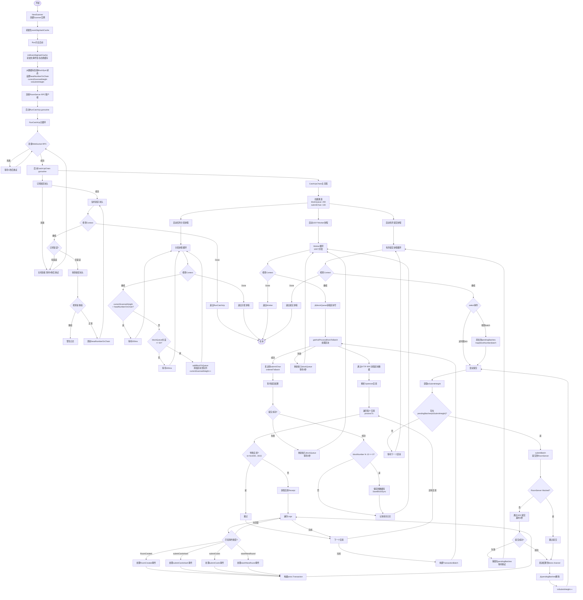
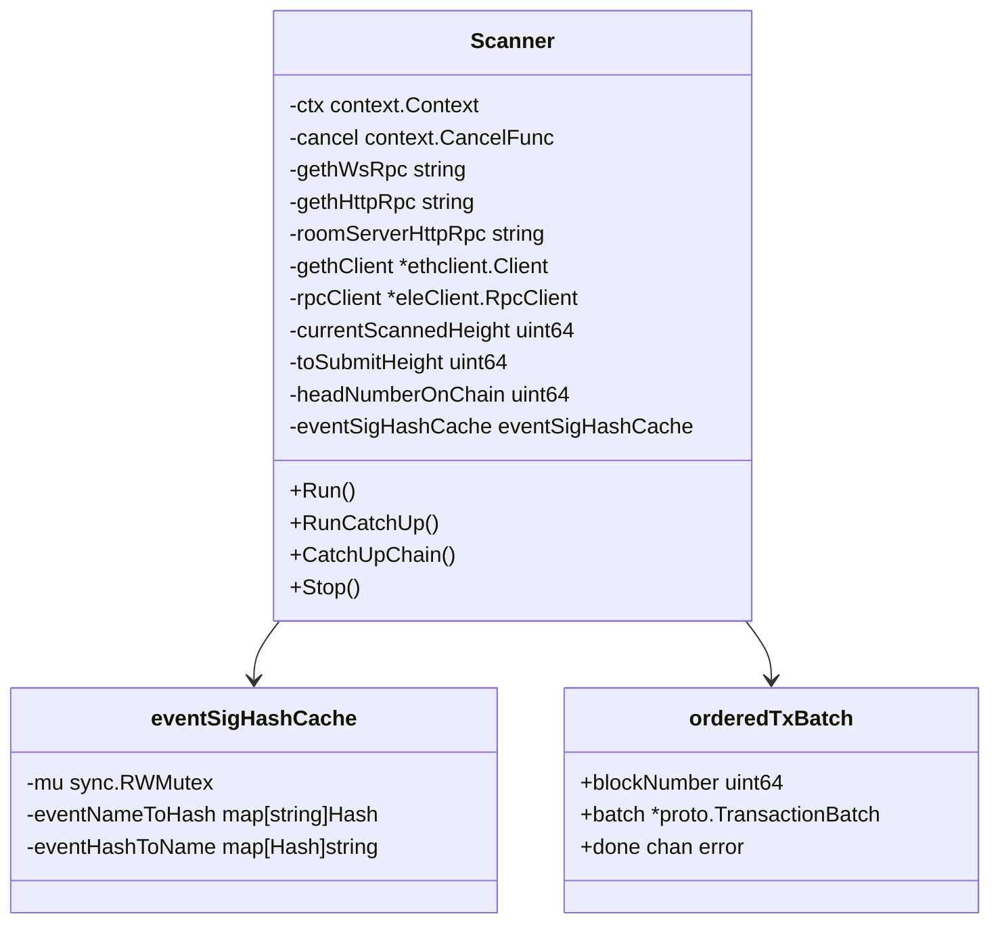
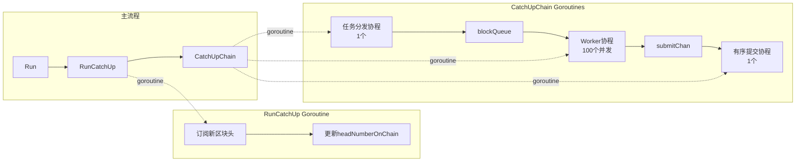
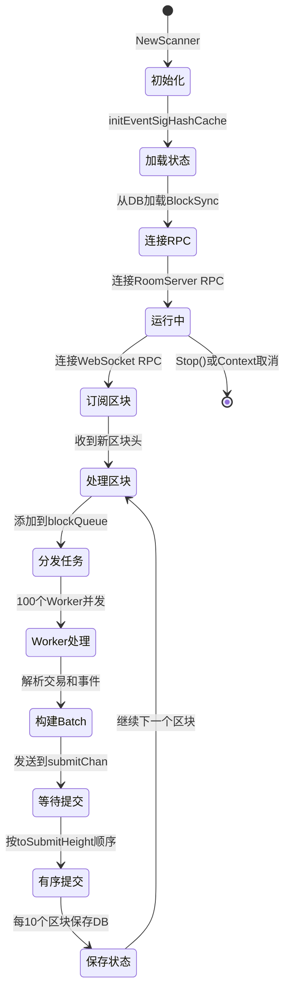

# Scanner 流程图

## 整体架构流程图

## 关键数据结构

## 并发模型

## 状态流转

## 关键流程说明

### 1. 初始化阶段
- 初始化事件签名哈希缓存（Room和RoomManager合约事件）
- 从数据库加载上次同步的区块高度
- 连接RoomServer RPC客户端

### 2. 区块订阅阶段（RunCatchUp）
- 通过WebSocket订阅新区块头
- 实时更新链头高度（headNumberOnChain）
- 检测链重组并记录警告

### 3. 区块处理阶段（CatchUpChain）
- **任务分发协程**：控制投递速度，避免队列过载
- **Worker协程**（100个并发）：
  - 从blockQueue获取区块号
  - 通过HTTP RPC获取区块数据
  - 解析交易并提取相关事件
  - 构建TransactionBatch
- **有序提交协程**：
  - 接收Worker处理完成的batch
  - 按toSubmitHeight顺序提交到RoomServer
  - 保证提交顺序与区块顺序一致

### 4. 事件处理
支持4种事件类型：
- `RoomCreated`: 房间创建事件
- `submitCardsHash`: 提交卡牌哈希
- `submitCards`: 提交卡牌
- `startANewRound`: 开始新回合

### 5. 错误处理和重试
- 连接失败自动重试（5秒间隔）
- 区块处理失败重新放入队列
- 提交失败保留在pendingBatches等待重试
- 每10个区块保存一次状态到数据库

