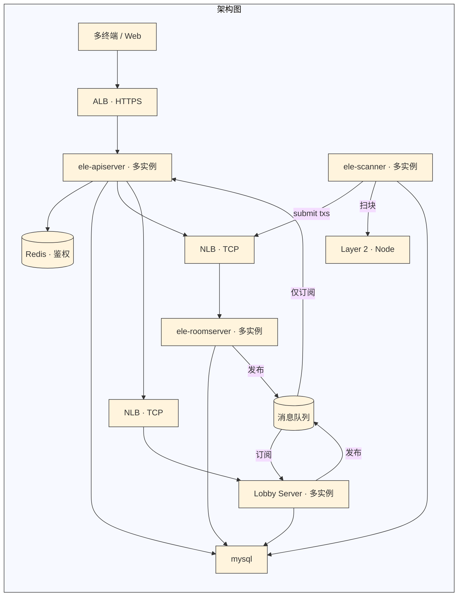

# 架构概览

---

## 核心服务

| 服务 | 职责 |
|------|------|
| **ele-apiserver** | **多实例**；HTTP、Session；**鉴权等用 Redis**；经 NLB 调 Room / Lobby；**只从 MQ 消费** |
| **Lobby Server** | **多实例**；大厅与匹配；**向 MQ 发布并订阅** |
| **ele-roomserver** | **多实例**；对战、链上交互；**向 MQ 发布** |
| **消息队列** | **Room / Lobby 生产**；**Lobby、API 消费** |
| **ele-scanner** | **多实例**；**扫 Layer2**；**经 NLB（Room）** 调 Room；落库 |

---