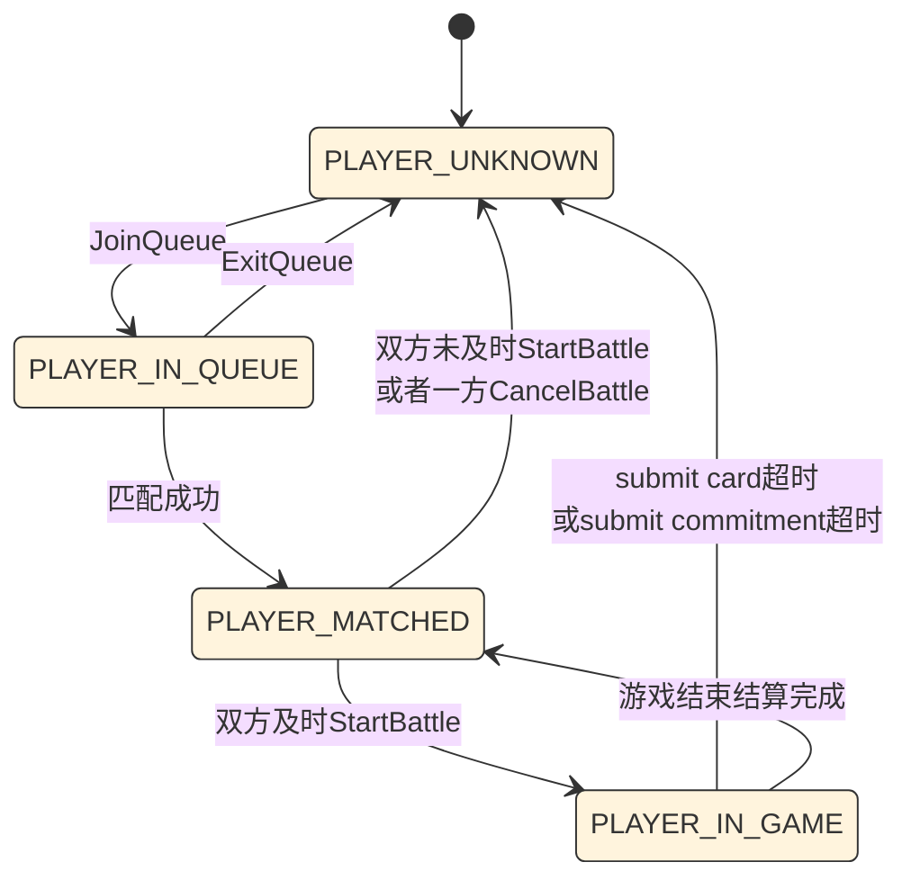
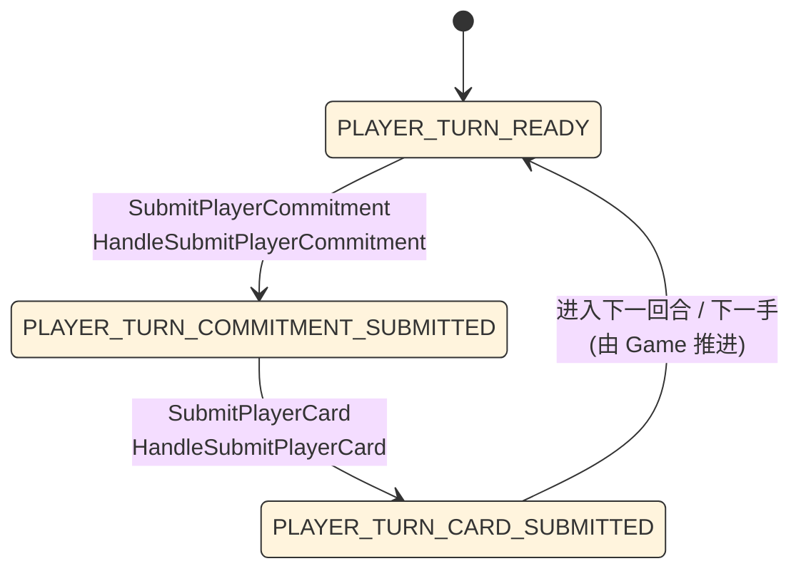

# Player 状态与事件

## 会话级：`PlayerStatus`

```mermaid
%%{init: {'theme': 'base', 'themeVariables': {'lineColor':'#333','primaryBorderColor':'#333','primaryTextColor':'#333','secondaryBorderColor':'#333','tertiaryBorderColor':'#333'}}}%%
stateDiagram-v2
    [*] --> PLAYER_UNKNOWN

    PLAYER_UNKNOWN --> PLAYER_IN_QUEUE : JoinQueue

    PLAYER_IN_QUEUE --> PLAYER_MATCHED : 匹配成功

    PLAYER_IN_QUEUE --> PLAYER_UNKNOWN : ExitQueue

    PLAYER_MATCHED --> PLAYER_IN_GAME : 双方及时StartBattle

    PLAYER_MATCHED --> PLAYER_UNKNOWN : 双方未及时StartBattle<br/>或者一方CancelBattle

    PLAYER_IN_GAME --> PLAYER_UNKNOWN : submit card超时<br/>或submit commitment超时

    PLAYER_IN_GAME --> PLAYER_MATCHED : 游戏结束结算完成
```

---

## Turn内回合级：`PlayerTurnStatus`（`PLAYER_IN_GAME` 期间）

```mermaid
%%{init: {'theme': 'base', 'themeVariables': {'lineColor':'#333','primaryBorderColor':'#333','primaryTextColor':'#333','secondaryBorderColor':'#333','tertiaryBorderColor':'#333'}}}%%
stateDiagram-v2
    [*] --> PLAYER_TURN_READY

    PLAYER_TURN_READY --> PLAYER_TURN_COMMITMENT_SUBMITTED : SubmitPlayerCommitment<br/>HandleSubmitPlayerCommitment

    PLAYER_TURN_COMMITMENT_SUBMITTED --> PLAYER_TURN_CARD_SUBMITTED : SubmitPlayerCard<br/>HandleSubmitPlayerCard

    PLAYER_TURN_CARD_SUBMITTED --> PLAYER_TURN_READY : 进入下一回合 / 下一手<br/>(由 Game 推进)
```

---
