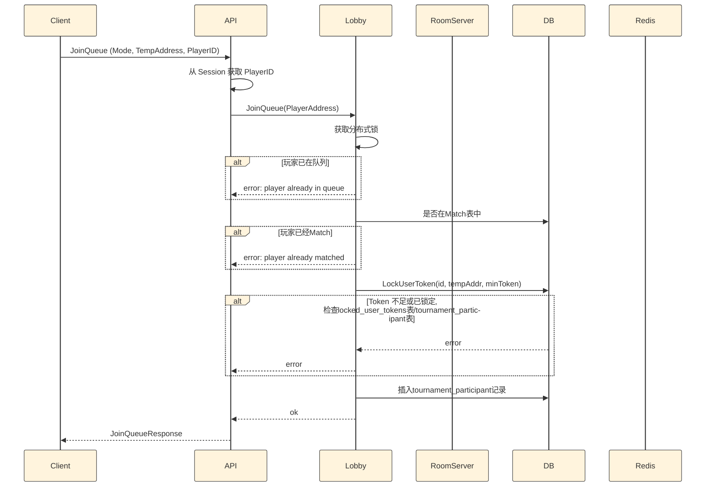
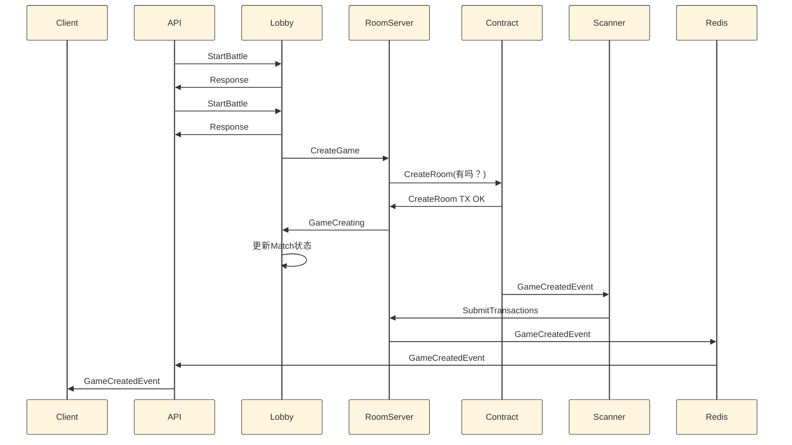
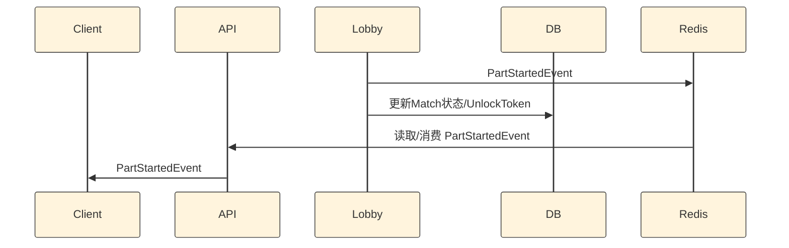
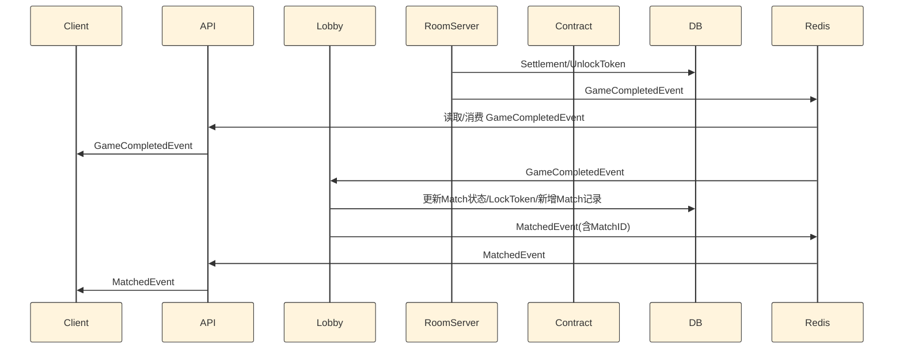
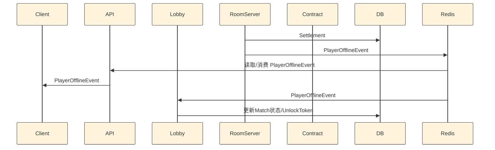
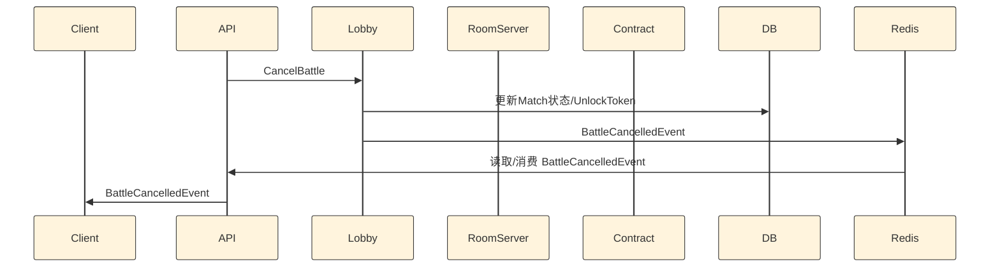

# 排队匹配流程

## 时序图：PVP JoinQueue

## 时序图：PVP StartBattle

## 时序图：PVP 超时后未双方Start

## 时序图：PVP Game决出结果后结束
游戏双方决出胜负后结束。

## 时序图：PVP Game至少一方弃赛后结束
至少一方，弃赛，超时后结束。

## 时序图：PVP Game决出结果结束后，至少一方不再继续

## 时序图：PVP Game决出结果结束后，至少一方没有操作后超时
统一到PVP 超时后未双方Start
