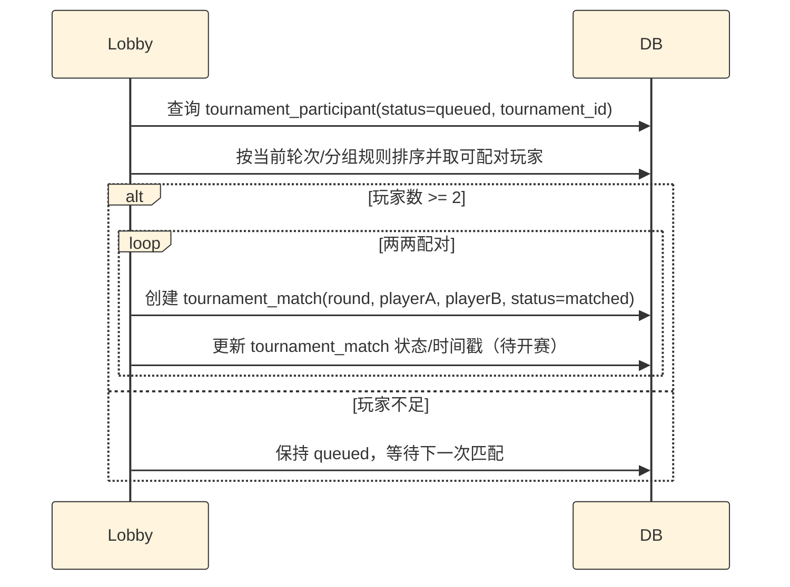
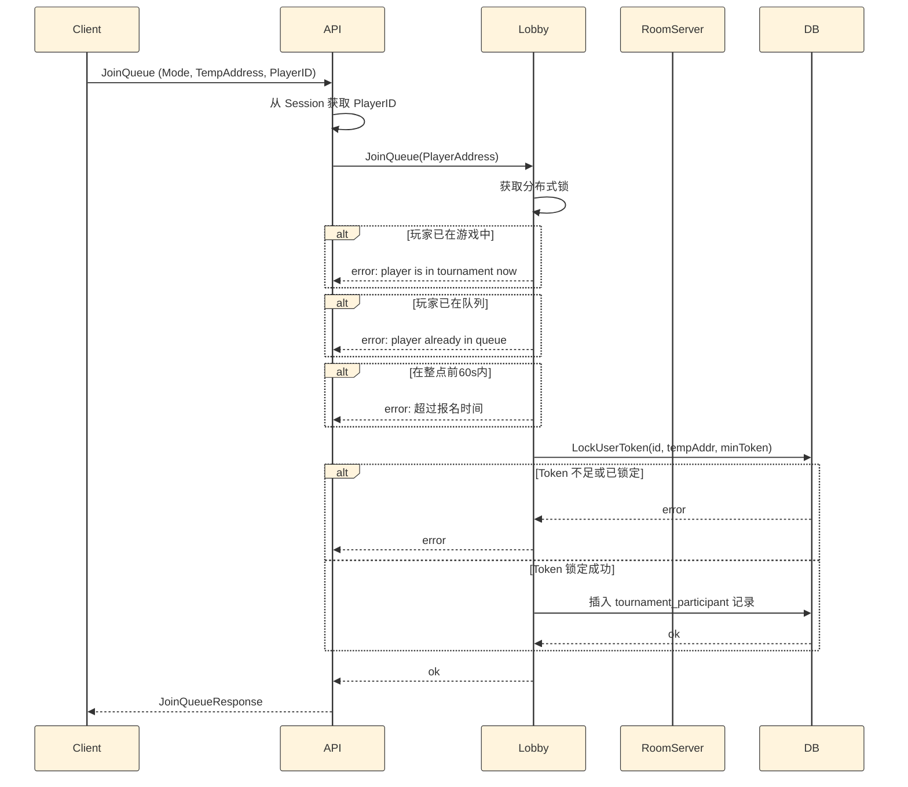
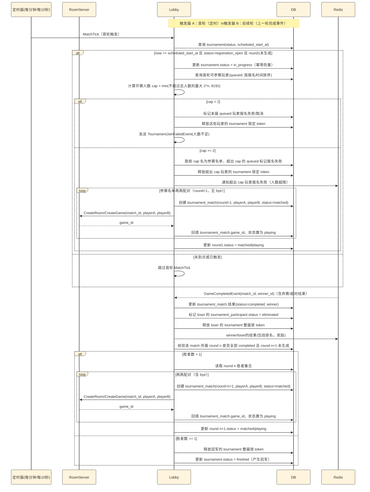

# 排队匹配流程

## 时序图：Tournament记录自动生成

```mermaid
%%{init: {'theme': 'base', 'themeVariables': {'lineColor':'#333','primaryBorderColor':'#333','primaryTextColor':'#333','secondaryBorderColor':'#333','tertiaryBorderColor':'#333'}}}%%
sequenceDiagram
    participant Lobby
    participant DB

    Lobby->>DB: 查询 tournament_participant(status=queued, tournament_id)
    Lobby->>DB: 按当前轮次/分组规则排序并取可配对玩家
    alt 玩家数 >= 2
        loop 两两配对
            Lobby->>DB: 创建 tournament_match(round, playerA, playerB, status=matched)
            Lobby->>DB: 更新 tournament_match 状态/时间戳（待开赛）
        end
    else 玩家不足
        Lobby->>DB: 保持 queued，等待下一次匹配
    end
```

## 时序图：Tournament JoinQueue

```mermaid
%%{init: {'theme': 'base', 'themeVariables': {'lineColor':'#333','primaryBorderColor':'#333','primaryTextColor':'#333','secondaryBorderColor':'#333','tertiaryBorderColor':'#333'}}}%%
sequenceDiagram
    participant Client
    participant API
    participant Lobby
    participant RoomServer
    participant DB

    Client->>API: JoinQueue (Mode, TempAddress, PlayerID)
    API->>API: 从 Session 获取 PlayerID
    API->>Lobby: JoinQueue(PlayerAddress)
    Lobby->>Lobby: 获取分布式锁

    alt 玩家已在游戏中
        Lobby-->>API: error: player is in tournament now
    end

    alt 玩家已在队列
        Lobby-->>API: error: player already in queue
    end

    alt 在整点前60s内
        Lobby-->>API: error: 超过报名时间
    end

    Lobby->>DB: LockUserToken(id, tempAddr, minToken)
    alt Token 不足或已锁定
        DB-->>Lobby: error
        Lobby-->>API: error
    else Token 锁定成功
        Lobby->>DB: 插入 tournament_participant 记录
        DB-->>Lobby: ok
    end


    Lobby-->>API: ok
    API-->>Client: JoinQueueResponse
```

## 时序图：Tournament自动match players

```mermaid
%%{init: {'theme': 'base', 'themeVariables': {'lineColor':'#333','primaryBorderColor':'#333','primaryTextColor':'#333','secondaryBorderColor':'#333','tertiaryBorderColor':'#333'}}}%%
sequenceDiagram
    participant Timer as 定时器(每分钟/每10秒)
    participant RoomServer
    participant Lobby
    participant DB
    participant Redis

    Note over Lobby,DB: 触发器 A：首轮（定时）\n触发器 B：后续轮（上一轮完成事件）

    Timer->>Lobby: MatchTick（首轮触发）
    Lobby->>DB: 查询 tournament(status, scheduled_start_at)
    alt now >= scheduled_start_at 且 status=registration_open 且 round1未生成
        Lobby->>DB: 更新 tournament.status = in_progress（幂等防重）
        Lobby->>DB: 查询首轮可参赛玩家(queued, 按报名时间排序)
        Lobby->>Lobby: 计算开赛人数 cap = min(不超过总人数的最大 2^n, 8192)
        alt cap < 2
            Lobby->>DB: 标记本届 queued 玩家报名失败/取消
            Lobby->>DB: 释放这些玩家的 tournament 锁定 token
            Lobby->>Lobby: 发送 TournamentJoinFailedEvent(人数不足)
        else cap >= 2
            Lobby->>DB: 取前 cap 名为参赛名单，超出 cap 的 queued 标记报名失败
            Lobby->>DB: 释放超出 cap 玩家的 tournament 锁定 token
            Lobby->>Redis: 通知超出 cap 玩家报名失败（人数超限）
            loop 参赛名单两两配对（round=1，无 bye）
                Lobby->>DB: 创建 tournament_match(round=1, playerA, playerB, status=matched)
                Lobby->>RoomServer: CreateRoom/CreateGame(match_id, playerA, playerB)
                RoomServer-->>Lobby: game_id
                Lobby->>DB: 回填 tournament_match.game_id，状态置为 playing
            end
            Lobby->>DB: 更新 round1.status = matched/playing
        end
    else 未到点或已触发
        Lobby->>Lobby: 跳过首轮 MatchTick
    end

    Redis-->>Lobby: GameCompletedEvent(match_id, winner_id)（含弃赛/超时结果）
    Lobby->>DB: 更新 tournament_match 结果(status=completed, winner)
    Lobby->>DB: 标记 loser 的 tournament_participant.status = eliminated
    Lobby->>DB: 释放 loser 的 tournament 整届锁 token
    Lobby->>Redis: winner/loser的结果(包括排名，奖励)
    Lobby->>DB: 校验该 match 所属 round n 是否全部 completed 且 round n+1 未生成
    alt 胜者数 > 1
        Lobby->>DB: 读取 round n 胜者集合
        loop 两两配对（含 bye）
            Lobby->>DB: 创建 tournament_match(round=n+1, playerA, playerB, status=matched)
            Lobby->>RoomServer: CreateRoom/CreateGame(match_id, playerA, playerB)
            RoomServer-->>Lobby: game_id
            Lobby->>DB: 回填 tournament_match.game_id，状态置为 playing
        end
        Lobby->>DB: 更新 round n+1.status = matched/playing
    else 胜者数 == 1
        Lobby->>DB: 释放冠军的 tournament 整届锁 token
        Lobby->>DB: 更新 tournament.status = finished（产生冠军）
    end
```